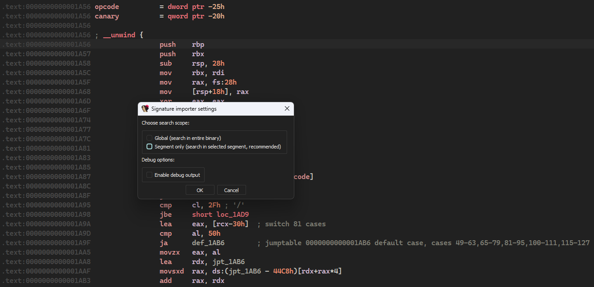
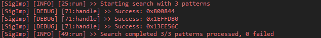

# sig-importer

## Description:
IDA Pro 9.x Plugin that automatically transfers the progress between dumps by using special *.json file that defines a number of fields for finding and signing addresses. 
The provided plugin is a PET project developed while learning IDA SDK C++.

## Requirements:
IDA Pro 9.x **only**

## Installation:
Put it into plugins folder of **your** IDA installation.

## Usage:

Launch the plugin by pressing hotkey (by default “Ctrl+Shift+F10”) or via Edit -> Plugin -> Signature Importer. Select the search area in the window appeared, for large binaries “Segment only” is recommended.



If you select “Segment only” you will need to enter the segment name (default is .text). When selecting “Global” segment selection is skipped and we proceed to the next step.


Select *.json with signatures and wait for the search and signing to complete.




### JSON Configuration Format

The plugin uses JSON files to define signature patterns and their associated metadata. Each pattern is an object in a JSON array.

#### Field Reference

| Field | Required | Description |
|-------|----------|-------------|
| `signature` | + | Byte pattern with wildcards (`?` for unknown bytes) |
| `name` | - | Sets symbol name at found address |
| `cmt` | - | Adds comment to address or function |
| `color` | - | Sets background color (RGB number) |
| `offset` | - | Offset to apply to found address |
| `rip_layout` | - | For RIP-relative `[opcodes, data] ([prefix][rex][opcode][modr/m][imm][displ])` |

#### Example Configuration

```json
[
    {
        "name": "simple_function",
        "signature": "4C 8D B8 ? ? ? ? 66 45 3B 6F",
        "offset": -187,
        "color": 239100
    },
    {
        "name": "function_with_comment",
        "signature": "4C 8B 14 D0 EB ? 41 3B 0A 74",
        "offset": -40,
        "color": 16040282,
        "cmt": "Important function for data processing"
    },
    {
        "name": "rip_relative_global",
        "signature": "48 8B 05 ? ? ? ? 4C 8B 14 D0",
        "rip_layout": [3, 4],
        "cmt": "Resolves global variable reference"
    },
]
```