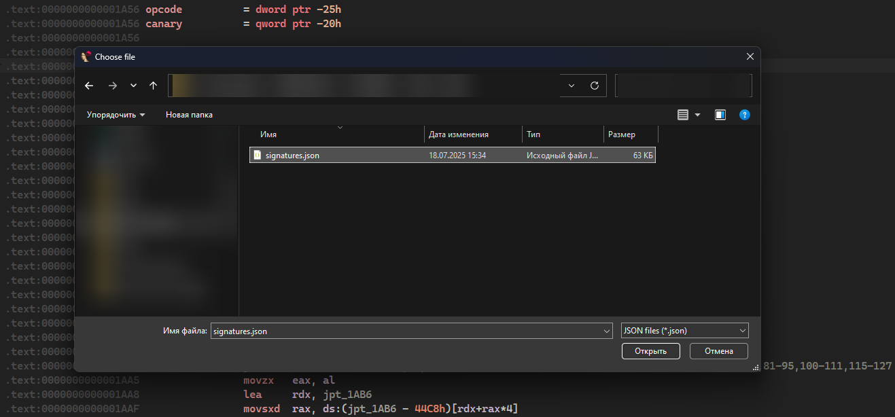

# Signature Importer

## Description
IDA Pro 9.x Plugin that automatically transfers the progress between dumps by using special *.json file that defines a number of fields for finding and signing addresses.

## Requirements
IDA Pro 9.x **only**.

## Transfer capabilities
- Names (functions and variables)
- Type declarations (functions and variables)
- Comments (anything)
- Colors (anything)
- Breakpoints (anything)

## Installation
Put it into plugins folder of **your** IDA installation.

## Usage
Launch the plugin by pressing hotkey (by default “**Ctrl+Shift+F10**”) or via **Edit -> Plugin -> Signature Importer**. Select the search area in the window appeared, for large binaries **“Segment only”** or **"Custom"** is recommended.


When selecting **“Global”**, we skip entering segment name and address range and proceed to json file selection.\
If you select **“Segment only”** you will need to enter the segment name (default is .text).


If you select **“Custom”** you will need to enter the range: start and end address (default is 0x1000 - 0x100000).



 Select *.json with signatures and wait for the search and signing to complete.


## Result


## JSON configuration format
The plugin uses **JSON files** to define signature patterns and their associated metadata. Each pattern is an object in a JSON array.

## Field reference
| Field                      | Required | Type | Description                                                                                                                                                                                                                                                                          |
|----------------------------|----------|------|--------------------------------------------------------------------------------------------------------------------------------------------------------------------------------------------------------------------------------------------------------------------------------------|
| `signature`                | + | string | Byte pattern with wildcards (`?` or `??` for unknown bytes)                                                                                                                                                                                                                          |
| `name`                     | - | string | Sets name for function/variable at the found address                                                                                                                                                                                                                                 |
| `declaration`              | - | string | Sets function/variable type and name                                                                                                                                                                                                                                                 |
| `comment`                  | - | string | Adds comment to address or function                                                                                                                                                                                                                                                  |
| `color`                    | - | number | Sets background color (RGB value in decimal format)                                                                                                                                                                                                                                  |
| `operations`               | - | array | Array with data (`offset`, `insn_format`) for calculating final effective address. Possible fields: offset, insn_format. Fields can be arranged in any order and repeated.Operations executed sequentially from lower to higher index                                                |
| `operations[].offset`      | - | number | Is used for calculating final effective address by using basic operation (to current address += offset)                                                                                                                                                                              |
| `operations[].insn_format` | - | array | Is used for obtaining relative offset. Calculation is performed as follows: for instruction at 0x1000 `"E8 12 34 56 78"` with format `[1,4]`: `rip = 0x1000 + 1 + 4`, `rel_offset = read_dword(0x1000 + 1)`, `final_address = rip + rel_offset`                                      |
| `breakpoint`               | - | array | Breakpoint configuration `[exist, type, size]`. Type: 0=software+execute (default), 1=write, 2=read, 3=read/write, 4=software, 8=execute, 12=default. Size is irrelevant for software breakpoints. For hardware breakpoints size matters but can't always be set to arbitrary values |

## Example configuration
```json
[
  {
    "name": "function_with_comment",
    "signature": "E8 ? ? ? ? 0F B7 45 ? 41 B9",
    "declaration": "void* function_with_comment(int value);",
    "operations": [
      {"insn_format": [1, 4]},
      {"offset": 26},
      {"insn_format": [1, 4]}
    ],
    "comment": "Some important function for important matters",
    "color": 15658724,
    "breakpoint": [true, 0, 0]
  },
  {
    "name": "global_variable",
    "signature": "48 8B 05 ?? ?? ?? ?? 4C 8B 14 D0",
    "operations": [
      {"insn_format": [3, 4]}
    ],
    "comment": "Something very important"
  },
  {
    "name": "some_math_handler",
    "signature": "48 89 5C 24 ? 48 89 74 24 ? 48 89 7C 24 ? 55 41 56 41 57 48 8B EC"
  },
  {
    "comment": "just_comment",
    "signature": "7E ? 83 F9 ? 7E ? 83 F9 ? 74 ? 7E"
  }
]
```